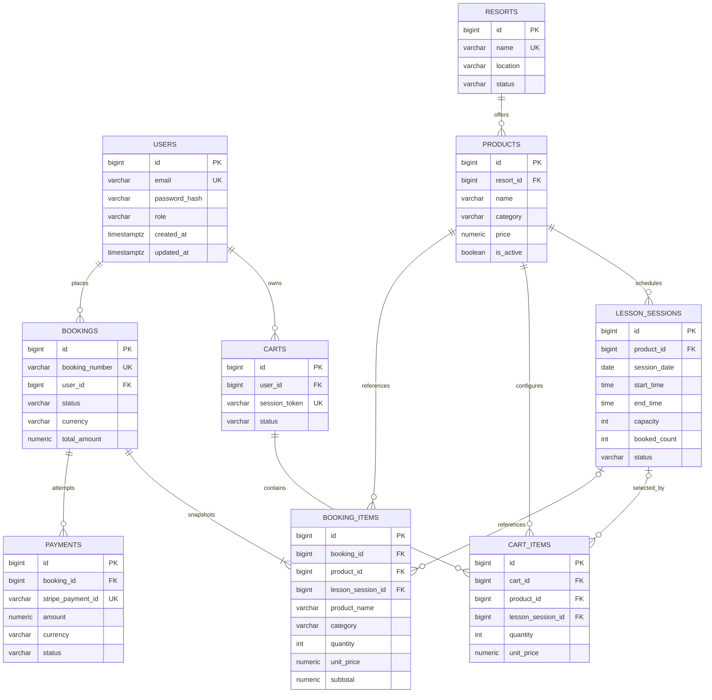

# Entity Relationship Diagram

The database is managed by Flyway. The authoritative executable schema is
[`V1__create_core_schema.sql`](../backend/src/main/resources/db/migration/V1__create_core_schema.sql).

## Controlled values

- Product category: `RESORT_ACCESS`, `LIFT_TICKET`, `LESSON`, `RENTAL`
- User role: `CUSTOMER`, `ADMIN`
- Resort status: `ACTIVE`, `INACTIVE`
- Lesson session status: `ACTIVE`, `CANCELLED`
- Cart status: `ACTIVE`, `CHECKED_OUT`, `ABANDONED`
- Booking status: `PENDING`, `CONFIRMED`, `CANCELLED`, `COMPLETED`
- Payment status: `PENDING`, `SUCCEEDED`, `FAILED`, `REFUNDED`

Database check constraints enforce these values and protect positive quantities,
non-negative monetary amounts, valid date ranges, and lesson capacity bounds.

